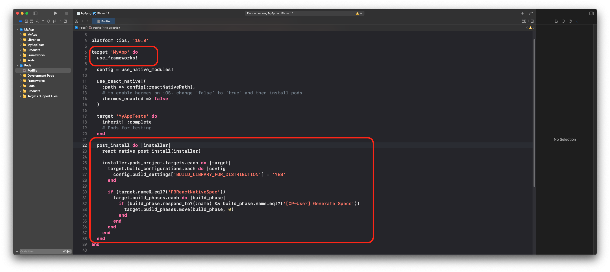

# Uncompress React Native


[](https://codecov.io/gh/didisouzacosta/uncompress)
[](https://opensource.org/licenses/MIT) [](CONTRIBUTING.md)

Simple library to decompress files `.zip`, `.rar`, `.cbz` and `.cbr` in React Native.

<table>
  <tr>
    <td></td>
    <td></td>
  </tr>
</table>

## Installation

```sh
yarn add uncompress-react-native

or

npm install uncompress-react-native
```

## iOS Pods installation

After installing the library, you can install pods using the command: `cd ios && pod install && cd ..`

• If you will have problems with the installation of the dependency `UnrarKit`, you need add in your Podfile `use_frameworks!`

• If you will have problems with `[CP-User] Generate Specs` after add `use_frameworks!`, you can modify your `post_install` to fix.

[The solution discussion reference](https://github.com/facebook/react-native/issues/31034#issuecomment-812564390)

```ruby
post_install do |installer|
  react_native_post_install(installer)

  installer.pods_project.targets.each do |target|
    target.build_configurations.each do |config|
      config.build_settings['BUILD_LIBRARY_FOR_DISTRIBUTION'] = 'YES'
    end

    if (target.name&.eql?('FBReactNativeSpec'))
      target.build_phases.each do |build_phase|
        if (build_phase.respond_to?(:name) && build_phase.name.eql?('[CP-User] Generate Specs'))
          target.build_phases.move(build_phase, 0)
        end
      end
    end
  end
end
```



## Usage

```js
import Uncompress from 'uncompress-react-native';

// ...
await Uncompress.extract({
  filePath: 'temp/sample_comic.cbr',
  destination: 'data/comic',
});
// ...
```

## Extract protected file

```js
// ...
await Uncompress.extract({
  filePath: 'temp/sample_protected_comic.cbr',
  destination: 'data/comic',
  password: '123',
});
// ...
```

## Override files after extraction if successful

```js
// ...
await Uncompress.extract({
  filePath: 'temp/sample_protected_comic.cbr',
  destination: 'data/comic',
  override: true,
});
// ...
```

## Contributing

See the [contributing guide](CONTRIBUTING.md) to learn how to contribute to the repository and the development workflow.

## Credits

1. [UnrarKit](https://github.com/abbeycode/UnrarKit)
2. [SSZipArchive](https://github.com/ZipArchive/ZipArchive)
3. [slf4j](https://github.com/qos-ch/slf4j)
4. [junrar](https://github.com/junrar/junrar)

## License

[MIT](LICENSE)
